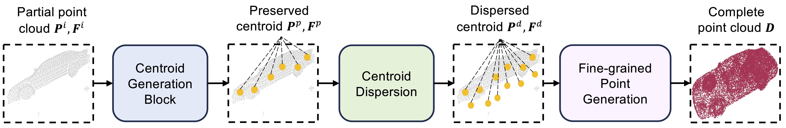
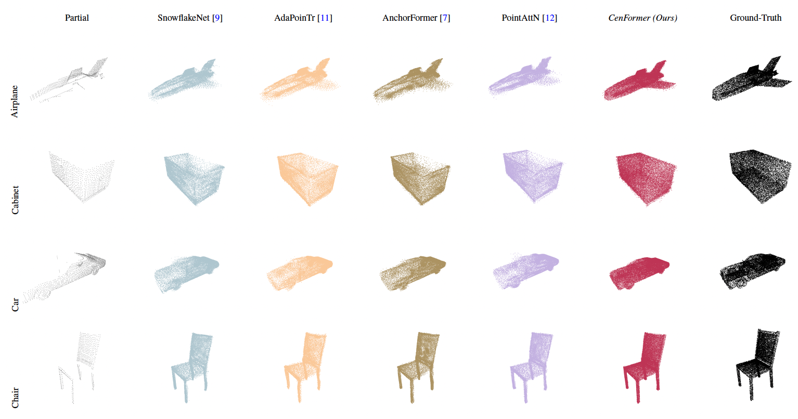

# CenFormer: Transformer-based Network from Centroid Generation for Point Cloud Completion



## 1. Revision 1

We have updated the code and pretrained models for KITTI dataset and ShapeNet dataset. All the pre-trained models can be found [here](https://uowmailedu-my.sharepoint.com/:u:/r/personal/ttpn997_uowmail_edu_au/Documents/dataset/ATT-Net/pretrained.zip?csf=1&web=1&e=UeRTdU).

To download datasets, please check PoinTr (https://github.com/yuxumin/PoinTr/tree/master).

## 2. Installation

We provide instructions for creating a conda environment for training and predicting. (Note that we use CUDA Version 11.8).

```
sh ./env.sh
```

## 3. Sample code on PCN dataset

### 3.1. Prediction

To make predictions, follow these steps:

1. Download the test dataset from [this link](https://uowmailedu-my.sharepoint.com/:u:/r/personal/ttpn997_uowmail_edu_au/Documents/dataset/ATT-Net/test.tar.gz?csf=1&web=1&e=Sn6rpK). Extract it to the folder `./PCN/test/`.

2. Download the pretrained weight (**pretrained/PCN/best.pt**) from [this link](https://uowmailedu-my.sharepoint.com/:u:/r/personal/ttpn997_uowmail_edu_au/Documents/dataset/ATT-Net/pretrained.zip?csf=1&web=1&e=UeRTdU). Then put the pretrained weight in the folder `./pretrained/PCN/`.


3. Run the following command to perform predictions:

    ```
    python predict.py --cate airplane --pretrained pretrained/PCN/best.pt
    ```

    Parameters:

   ```
   --cate (str) categories, such as airplane, cabinet, car, chair, lamp, sofa, table, watercraft.
   
   --pretrained (str) path to the pretrained model.
   ```



### 3.2. Training

To train the model, you need to follow these steps:

1. Download the validation dataset from [this link](https://uowmailedu-my.sharepoint.com/:u:/g/personal/ttpn997_uowmail_edu_au/EbxYcKtV_ahOpaAvq-A-9ZwBOqabr_5nddl7mWwhWJJ_Rw?e=FSiE7A).

2. Download the training dataset from [this link](https://uowmailedu-my.sharepoint.com/:u:/g/personal/ttpn997_uowmail_edu_au/EeffEPj7HgpGhkGQVshxqWwBRz6bGUjLmirj79GgFflyCA?e=HhemQE).

3. After downloading, extract the validation and training dataset files to the folders `./PCN/train/` and `./PCN/val/`, respectively.

4. To initiate the training process, execute the following command:

   ```
   python train.py --car False --batch-size 8 --model-name CenFormer --epoch 401 --num-pred 16384
   ```

   Parameters:
    
   ```
   --pretrained (str) path to the pretrained model.
    
   --car (bool) only use the CAR category for training.
    
   --batch-size (int) batch size.
    
   --model-name (str) name of the model.
    
   --epoch (int) number of epochs.
    
   --num-pred (int) number of the points in the final point cloud.
   ```
    
## References

Thank you [AnchorFormer](https://github.com/chenzhik/AnchorFormer), [PointTransformer](https://github.com/POSTECH-CVLab/point-transformer), and [PoinTr](https://github.com/yuxumin/PoinTr) for your wonderful code.
